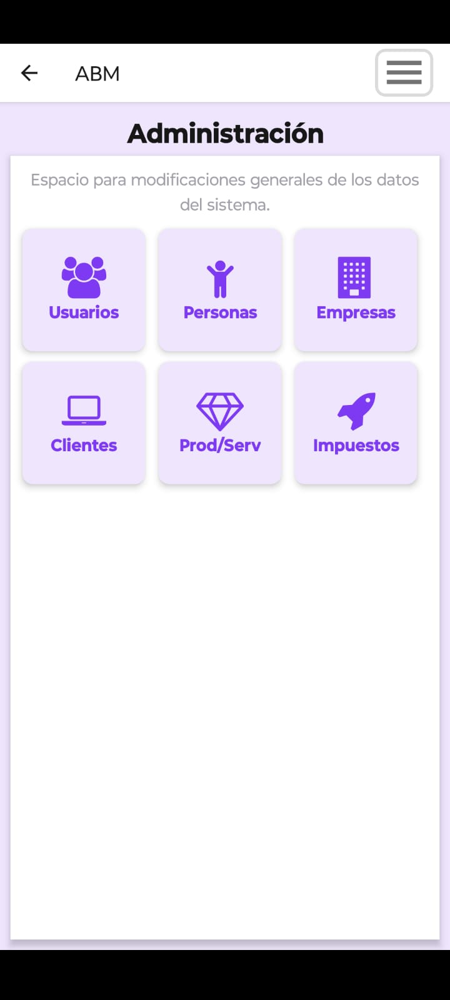
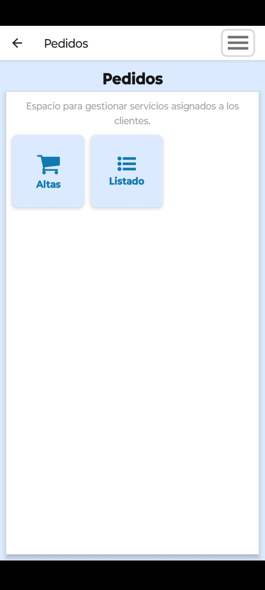
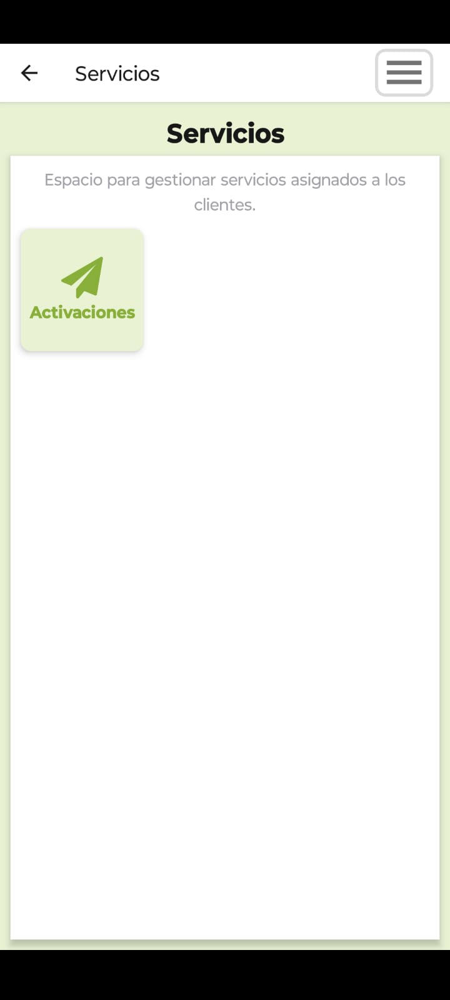
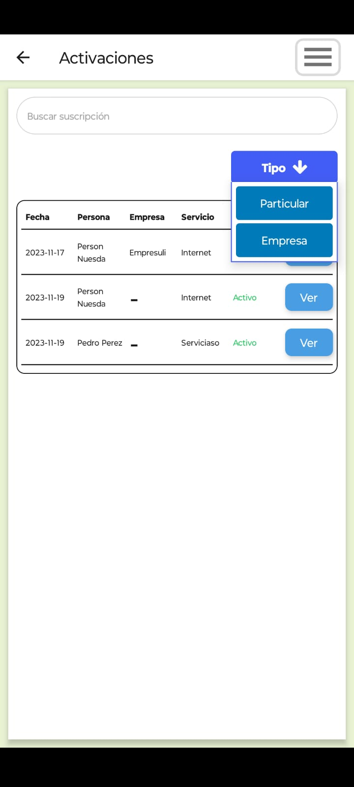
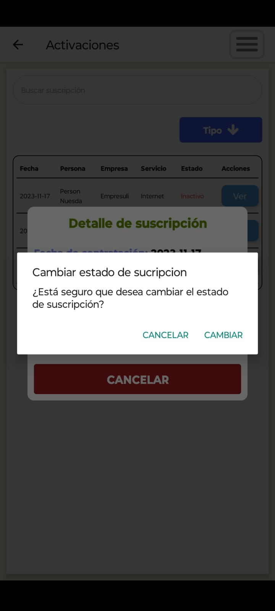
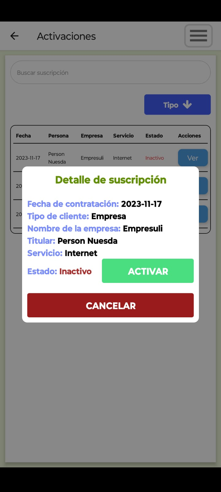
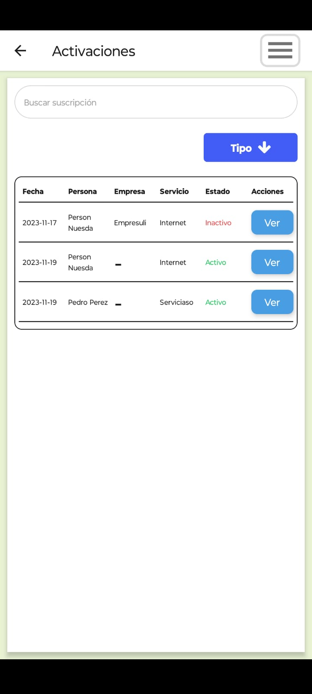

# App Mobile - BackOffice Crisalis

  
  

## DESCARGÁ LA ÚLTIMA VERSIÓN DE LA APP EN DESARROLLO
 

  
  

    

### Este proyecto reutiliza la tecnología que se eligió para el front end para poder así, con los conceptos del desarrollo web, poder crear una extensión multiplataforma de la aplicación principal (web).

### React Native provee soporte nativo para iOS y Android, es decir que la aplicación resultante se puede buildear para los dos sistemas operativos mobile mas utilizados al día de la fecha manejando sus respectivas apis (crea componentes nativos). 

### Otra de las ventajas de ésta tecnología es la reducción de tiempos y costos, pudiendo así con un mismo equipo desarrollar ambas plataformas en simultáneo (en este caso, una vez que se se comprueba el funcionamiento en plataforma web se transfiere la lógica sin problemas). 

### La inserción de este modelo de aplicación en el proyecto favorece el trabajo de campo por parte de los técnicos u operarios que deban realizar visitas físicas en las instalaciones donde se proveen los servicios y le proporciona valor agregado al producto al brindar un servicio mas abarcativo a nuestro cliente.

## Sprint 1 (DONE)

  
  
  
  
  
  
  
  
  
  

## Sprint 2 (WORK IN PROGRESS) status: en crud empresas

  
  

## Sprint 3 (WORK IN PROGRESS)
### Se mejora la ui, se añaden los roles, el técnico solo ve servicios

  
  
  
  
  
  
  

## Sprint 4 (PENDING)

